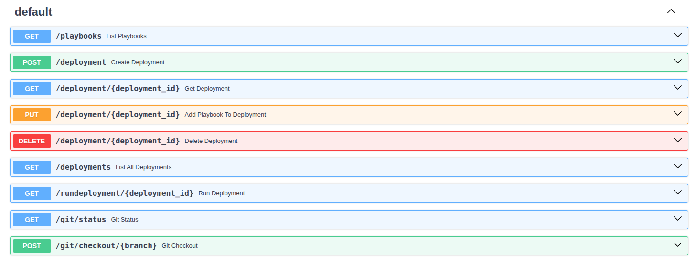

# Ansible Deployment Monitor

Dieses Tool führt mehrere Ansible-Playbooks aus, misst deren Laufzeit und Status, speichert Metriken in SQLite und pusht sie an Prometheus Pushgateway.

## 📦 Features

- Ausführung mehrerer Playbooks mit Retry-Logik
- Übergabe von Inventories
- Zeitmessung, Exit-Code, Anzahl der Versuche
- Speicherung in `deployment.db` (SQLite)
- Push von Metriken an Prometheus Pushgateway
- REST-API zur Steuerung von Playbooks und git branches
- Grafana-Dashboard zur Visualisierung

## ⚙️ Konfiguration (`config.yaml`)

```yaml
base_path: /opt/dpl

playbooks:
  - name: folder
    file: playbooks/folder.yaml
    retries: 1
  - name: file
    file: playbooks/file.yaml
    retries: 1

prometheus:
  job_name: ansible_deployment
  pushgateway_url: http://localhost:9091
```
* Erzeuge dann einen Ordner /opt/dpl, kopiere die Beispiele und initialisiere ein git repro daraus
```bash
sudo mkdir -p /opt/dpl
sudo chown -R $USER:$USER /opt/dpl
sudo chmod -R 775 /opt/dpl
cp -r inventories /opt/dpl/
cp -r playbooks /opt/dpl/
cd /opt/dpl
git init
git branch -M main
git add .
git commit -m "Initial commit of /opt/dpl structure"
git checkout -b feature-test
```

## uv setup
```
curl -LsSf https://astral.sh/uv/install.sh | sh
uv sync
uv pip compile pyproject.toml -o requirements.txt
uv run deploy.py
```

## 🚀 Ausführung
```bash
python deploy.py
```

## 🚀 Ausführung mit Invetories
```bash
python deploy.py -i inventories/home
```

## 🌐 Prometheus
Siehe: https://github.com/wlanboy/deployment_monitor/tree/main/prometheus/readme.md

## 📈 Grafana Dashboard
Siehe: http://localhost:3000/d/deployments/deployments?orgId=1&from=now-15m&to=now&timezone=browser&var-datasource=bezwwgua3ke80f&refresh=30s


#

## 🚀 Starten der API
```bash
.venv/bin/uvicorn api:app --reload --port 8000
```

## 🚀 Starten der API über docker compose
Siehe: https://github.com/wlanboy/deployment_monitor/tree/main/docker.md
```bash
docker-compose up
```

## Swagger API
* http://localhost:8000/docs


## 🚀 Beispiele
```bash
# liste playbooks
curl http://localhost:8000/playbooks

# run für ein playbook und ein inventory
curl "http://localhost:8000/run?playbook=playbooks/folder.yaml&inventory=inventories/home/home.yaml"

# run für ein playbook und in inventory mit tags und skip-tags
curl "http://localhost:8000/run?playbook=playbooks/folder.yaml&inventory=inventories/home/home.yaml&tags=create&skip_tags=check"
curl "http://localhost:8000/run?playbook=playbooks/folder.yaml&inventory=inventories/home/home.yaml&tags=check"
```

## Ausgabe playbooks
```
["playbooks/folder.yaml","playbooks/file.yaml"]
```

## Ausgabe run
```
▶ Starte Playbook: playbooks/folder.yaml (Versuch 1/1)

PLAY [Create and verify folder in home directory] ******************************

TASK [Gathering Facts] *********************************************************
ok: [localhost]

TASK [Create folder with 0755 permissions] *************************************
ok: [localhost]

TASK [Check folder permissions] ************************************************
ok: [localhost]

TASK [Fail if permissions are not 0755] ****************************************
skipping: [localhost]

PLAY RECAP *********************************************************************
localhost                  : ok=3    changed=0    unreachable=0    failed=0    skipped=1    rescued=0    ignored=0   


Ergebnis: playbooks/folder.yaml
Startzeit: 14:09:19
Endzeit:   14:09:24
Dauer (s): 5
Status:    ✅ Erfolgreich
Versuch:   1
Hosts:     localhost
Tasks OK:      3
Tasks Changed: 0
Tasks Skipped: 1
Tasks Failed:  0

✔ Playbook 'playbooks/folder.yaml' erfolgreich abgeschlossen.
```

## Deployment Verwaltung (nur rest api)
### 🧱 1. Deployment anlegen
```bash
curl -X POST "http://localhost:8000/deployment?name=ordnerunddatei"

# aus der Antwort die uuid nehmen
{"id":"76aaf757-761d-45a1-9136-ab05c02b7185","name":"ordnerunddatei"}
```

### ➕ 2. Playbooks hinzufügen
#### 🧩 Schritt 1: folder.yaml mit Tags und Skip-Tags
```bash
curl -X PUT "http://localhost:8000/deployment/76aaf757-761d-45a1-9136-ab05c02b7185?playbook=playbooks/folder.yaml&inventory=inventories/home/home.yaml&tags=create&skip_tags=check"

# Antwort
{"status":"added","deployment_id":"76aaf757-761d-45a1-9136-ab05c02b7185"}
```

#### 🧩 Schritt 2: file.yaml ohne Tags
```bash
curl -X PUT "http://localhost:8000/deployment/76aaf757-761d-45a1-9136-ab05c02b7185?playbook=playbooks/file.yaml&inventory=inventories/home/home.yaml"

# Antwort
{"status":"added","deployment_id":"76aaf757-761d-45a1-9136-ab05c02b7185"}
```

### 📦 3. Deployment anzeigen
```bash
curl "http://localhost:8000/deployment/76aaf757-761d-45a1-9136-ab05c02b7185"

# Antwort
{"id":"76aaf757-761d-45a1-9136-ab05c02b7185","name":"ordnerunddatei",
"items":[
{"playbook":"playbooks/folder.yaml","inventory":"inventories/home/home.yaml","tags":"create","skip_tags":"check"},{"playbook":"playbooks/file.yaml","inventory":"inventories/home/home.yaml","tags":null,"skip_tags":null}
]}
```

### 🚀 4. Deployment ausführen
```bash
curl "http://localhost:8000/rundeployment/76aaf757-761d-45a1-9136-ab05c02b7185"
```

## 📋 Git-Status anzeigen
```bash
curl "http://localhost:8000/git/status"
```

## 🔀 Branch wechseln
```bash
curl -X POST "http://localhost:8000/git/checkout/feature-test"
```